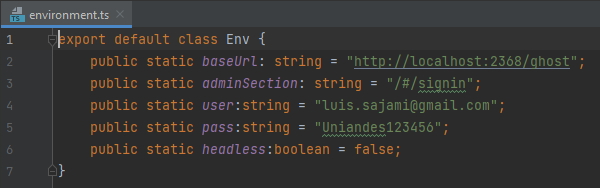

Sección dedicada a la explicación del empleo del código fuente para pruebas End-to-End (E2E).

# Escenarios de prueba

Según el equipo que generó este código en su momento, usaron de guía estos escenarios en su aplicación Ghost.

* PA001. Edición de página: Se accede a la sección de creación de nueva página y se crea una nueva página. Luego desde sección de páginas se accede a página creada y se edita su titulo y contenido, y se verifica su contenido actualizado en sitio de contenido.
* PA002. Publicación programada de página: Desde sección de posts del sitio admin, se crea un nuevo post y se programa su publicación para una fecha futura (preferiblemente el mismo día) y luego pasado el tiempo necesario se verifica su publicación en sitio de contenido.
* PA003. Borrar página existente: Teniendo una página (vinculada o no en navbar) creada en el sitio, se verifica que se pueda borrar y que no quede listada en la sección de Páginas después del borrado
* PA004. Creación de página con título que trae carácteres no permitidos: Se accede a la sección de creación de nueva página, y se trata de crear una nueva página que incluya en su título carácteres no permitidos (por ejemplo ñ!@#¢∞¬÷), luego se verifica que ocurre error al tratar de publicarla.
* PA005. Enlazar nueva página en componente navbar: Al crearse una nuevá pagina vinculada al sitio, se vincula en navbar del sitio y se logra navegar a la misma desde dicho navbar
* PA006. Renombrar página y componente navbar asociado: Teniendo una página enlazada al navbar del sitio, se cambia el nombre de la página y del componente navbar (más su enlace interno) y se verifica que se puede acceder aun a la página editada desde el navbar.
* PA007. Renombrar página vinculada en navbar: Teniendo una página enlazada al navbar del sitio, se cambia el nombre de la página (pero no se modifica item navbar) y se verifica que al hacer clic en el enlace ya existente desde navbar no se pueda acceder a la pagina editada.
* PA008. Creación de tag y asignación a post: Teniendo un post ya creado en el sitio, se accede a sección de tags y se genera un nuevo tag, luego se aplica el tag creado al post deseado.
* PA009. Creación y eliminación de tag: Se accede a sección de tags y se genera un nuevo tag, se observa que el tag nuevo aparece en la sección de tags, luego se procede a borrarlo y se verifica que no aparezca en la sección de tags.
* PA010. Creación y edición de tag: Se accede a sección de tags y se genera un nuevo tag, se observa que el tag nuevo aparece en la sección de tags, luego se procede a editar sus detalles y se verifica que el tag incluya todos los cambios de propiedad.
* PA011. Borrar post existente en el sitio: Teniendo un post ya publicado en el sitio, se procede a borrar el mismo desde herramienta de administración, y se verifica su eliminación en la sección de gestión de posts
* PA012. Publicar post en draft: Habiendo generado un borrador o draft de un post para publicar en el sitio, se ingresa nuevamente a la página de edición del mismo, se edita y se publica, y luego se verifica su publicación en el sitio.
* PA013. Eliminar post en draft: Habiendo generado un borrador o draft de un post para publicar en el sitio, se ingresa nuevamente a la página de edición del mismo, se procede a eliminarlo, y luego se verifica que ya no aparezca en la sección de drafts.
* PA014. Asignar a post creado un tag deseado: Habiendo creado un nuevo post, se procede a editar el post y se aplica un tag deseado al mismo, luego se va al sitio de contenido y se verifica que el post tenga el tag aplicado.
* PA015. Verificar cambio de contraseña exitoso: Habiendo ingresado a la seccion de Your Profile de la cuenta logueada, se cambia la contraseña asociada a la cuenta a una nueva, y se verifica que el login fracase con la credencial vieja y que el login opere con la nueva clave.
* PA016. Verificar cambio de e-mail exitoso: Habiendo ingresado a la seccion de Your Profile de la cuenta logueada, se cambia el e-mail asociado a la cuenta por uno diferente, y se verifica que el login fracase al ingresar con el e-mail antiguo y que el login opere al usar el e-mail nuevo.
* PA017. Invitar un nuevo usuario del sitio: Habiendo ingresado a la sección de Staff, se invita a un nuevo usuario dando un correo para enviar invitación con el rol deseado, y se verifica que en la sección de invitados aparezca listado el correo de invitación.
* PA018. Revocar invitación a un nuevo usuario del sitio: Habiendo realizado una invitación para un nuevo usuario del sitio a través de e-mail, se ingresa a la sección de Staff, y se ubica el correo de invitación en el listado de invitaciones, y se realiza revocación de la invitación, luego se verifica que aparece un mensaje de revocación exitosa.
* PA019. Suspender a un usuario activo: Habiendo ingresado a la sección de Staff en el sitio de administración, se selecciona un usuario activo y se aplica suspensión del mismo desde la página de administración del susodicho
* PA020. Remover la suspensión puesta sobre un usuario: Habiendo ingresado a la sección de Staff en el sitio de administración, se selecciona un usuario suspendido y se remueve la suspensión sobre el mismo desde la página de administración del susodicho.

# Instrucciones de ejecución de código de escenarios de pruebas

## Precondiciones generales

1. Instalar node versiones 14 (recomendado v14.15.0)  segun su sistema operativo. Se recomienda NVM tanto para Windows como para sistemas Linux. Instrucciones disponibles tanto para Linux: (https://github.com/nvm-sh/nvm) o su spin'off en Windows (https://github.com/coreybutler/nvm-windows)
2. Tener instalada una instancia de Ghost v3.41.1. Más información en https://ghost.org/docs/install/local/
3. Ejecutar la instancia de Ghost con el comando `ghost start` si no lo ha hecho
4. Descargar los contenidos del repositorio en su carpeta de preferencia, sea por descarga de ZIP o por "git clone https://github.com/clts-uniandes/PruebasAutomatizadas.git"

## Kraken
   
### Prerequisitos:
- NodeJS 12 o posterior

### Ejecución de pruebas:
1. Ingresar al directorio kraken `cd kraken`
2. Instalar dependencias `npm install`
3. Configurar el archivo `kraken/properties.js` con los parametros `USERNAME`, `PASSWORD`, `LOGIN_URL` y `BASE_URL`
4. Ejecutar el comando `./node_modules/kraken-node/bin/kraken-node run`

## Playwright

### Prerequisitos:
- NodeJs 14 o posterior

### Ejecución de pruebas:
1. Ingresar al directorio playwright `cd Playwright`
2. Ejecutar el comando `npm install`
3. Configurar las variables `user` y `pass` de inicio de sesion ghost en el archivo `environment.ts` 
   que se encuentra en la carpeta `util`

4. Ejecutar el comando `npx playwright test`

Internamente el código indica a que escenario de los definidos en este README se redactaron las pruebas End to End asociadas.

